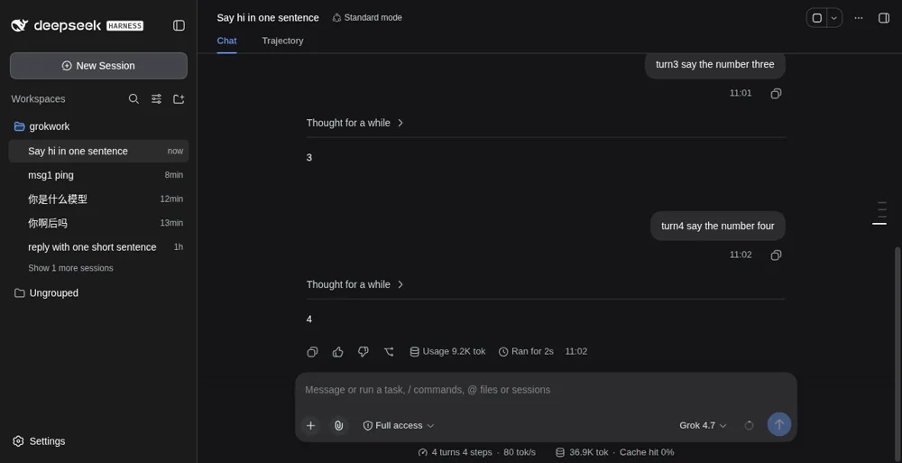
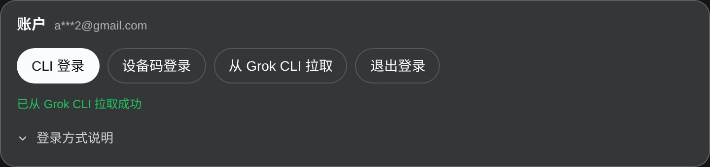
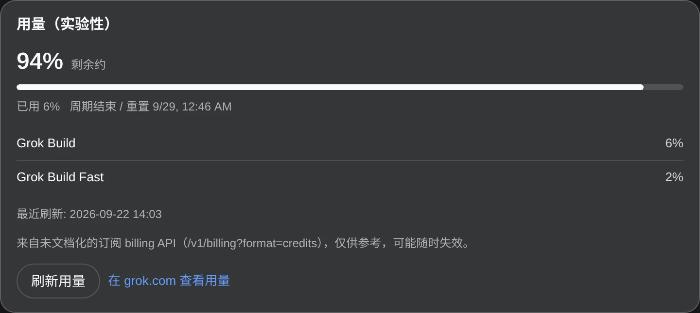
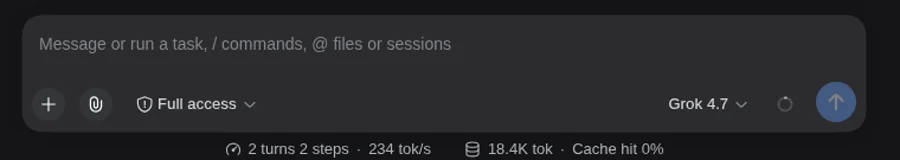

<div align="center">

# DSH Grok Subscription — Use SuperGrok / X Premium subscriptions in DeepSeek Harness

[简体中文](https://github.com/BaronCyrus/dsh-grok-subscription/blob/main/README.md) · **English**

**Use your SuperGrok / X Premium (Grok Build) subscription directly in DeepSeek Harness**

Reuse the official Grok Build CLI session — no `XAI_API_KEY` needed.
Models, reasoning effort, and weekly quota all stay inside DSH.

[](https://github.com/BaronCyrus/dsh-grok-subscription/actions/workflows/ci.yml)
[](https://www.npmjs.com/package/dsh-grok-subscription)
[](https://www.npmjs.com/package/dsh-grok-subscription)
[](LICENSE)
[](https://github.com/BaronCyrus/dsh-grok-subscription/stargazers)

[Three-step start](#three-step-start) · [Install](#install) · [Contribute](CONTRIBUTING.md) · [Update and uninstall](#update-and-uninstall)

</div>

<p align="center">
  
</p>

## Three-step start

1. **Install the plugin.** Run the command below; to select a candidate version, enter the full `package@version`, for example `dsh-grok-subscription@1.0.5`.

   ```sh
   dsh plugin --profile web add BaronCyrus/dsh-grok-subscription
   ```

2. **Sign in to the subscription.** Open **Settings → Grok Subscription** and click **CLI login** or **Device-code login**, then finish the official prompt in the terminal that started DSH. If you already ran `grok login` yourself, just click **Pull from Grok CLI** — nothing has to be pasted.
3. **Start using it.** Pick a model such as Grok 4.7 in the model picker. The round badge next to the picker shows weekly remaining quota, and the model menu offers reasoning effort levels.

Restart `dsh web` after installing or upgrading, otherwise the old `lib/` keeps running.

## Why this plugin

| Capability | What you get |
| --- | --- |
| **Direct subscription routing** | Reuse the official Grok Build CLI session — no `XAI_API_KEY` needed |
| **Real model catalog** | Read the models the account can actually use (such as `grok-4.7`, `grok-4.6`, `grok-4.5`) from `/v1/models-v2`; nothing is exposed while signed out |
| **Reasoning effort** | The model picker offers `low` / `medium` / `high` / `xhigh`, defaulting to `high`, matching the Codex interaction |
| **Composer quota** | A badge beside the model picker shows weekly remaining percentage; hover or click for "Weekly quota · N% left · resets M/D HH:mm" |
| **Usage panel (experimental)** | Settings shows the used and remaining percentages the backend reports, and never invents numbers when the read fails |
| **Credentials stay local** | Only the short-lived access token from `~/.grok/auth.json` is read on the host; no token is handed to browser RPC |
| **Sign-in state refreshes the UI** | Login, pull, and logout emit `llm/adapters-updated`, so the chat model list updates with them |
| **Automatic token renewal** | The access token only lives 6 hours; near expiry, or on a 401, the plugin runs the official `grok` CLI to refresh `auth.json` and retries once, so you never re-login by hand |
| **Failures stay visible** | When subscription routing is unavailable it reports an error instead of silently using another paid route |

These capabilities reuse the same local Grok Build sign-in.

## Product screen

<p align="center">
  
</p>

The **Settings → Grok Subscription** screen uses a status chip for the sign-in state, and an account card offering CLI login, device-code login, pull from the Grok CLI, and logout; how credentials are read lives in a collapsible "How signing in works" disclosure. It is styled with DSH's own design tokens, so it follows the light and dark theme. Account and time values in the screenshot are demo data.

<p align="center">
  
</p>

The experimental usage panel comes from an undocumented subscription billing endpoint (`/v1/billing?format=credits`): the remaining share is drawn as a progress bar and per-product rows are listed separately. It is informational: the endpoint may change or disappear, a failed read never shows an invented percentage, and chat is unaffected.

## Prepare DSH

This plugin supports the latest DeepSeek Harness release recorded in its package metadata and requires a **SuperGrok or X Premium** account that currently has Grok Build access.

- **Already able to run `dsh`**: use the standard command below;
- **Prefer the official path**: see the [DeepSeek Harness documentation](https://github.com/deepseek-ai/deepseek-harness#run).

The plugin is strict about `~/.grok/auth.json`: it refuses symbolic links, files readable by group or others, and files not owned by the current user. If permissions are wrong:

```sh
chmod 600 "${GROK_HOME:-$HOME/.grok}/auth.json"
```

## Install

### Standard DSH command

```sh
dsh plugin --profile web add BaronCyrus/dsh-grok-subscription
```

You can also install the version published on npm:

```sh
dsh plugin --profile web add dsh-grok-subscription@1.0.5
```

DSH handles target selection, the profile lock, dependency resolution, and bundle activation.

### Headless

Sign in and select a Grok model once in the Web UI, then install the same plugin into the standard DSH Headless profile:

```sh
dsh plugin --profile headless add BaronCyrus/dsh-grok-subscription
dsh --profile headless "reply with exactly: ok"
```

<details>
<summary>Official npm route (Node.js installed)</summary>

The official `npx @deepseek-ai/dsh web` does not create a global `dsh` command, so keep the full `npx` prefix when installing the plugin:

```sh
npx -y @deepseek-ai/dsh@0.1.5-rc.2 plugin --profile web add BaronCyrus/dsh-grok-subscription
npx -y @deepseek-ai/dsh@0.1.5-rc.2 plugin --profile web list dsh-grok-subscription --depth 0
npx -y @deepseek-ai/dsh@0.1.5-rc.2 --profile web --dump-config
```

</details>

<details>
<summary>Verify the install when <code>dsh</code> already works</summary>

```sh
dsh plugin --profile web list dsh-grok-subscription --depth 0
dsh --profile web --dump-config
```

The package list should contain exactly one `dsh-grok-subscription`, and the config exactly one `grok-build` route.

</details>

Restart DSH manually afterwards, then:

1. Open **Settings → Grok Subscription**;
2. Sign in with an account that has Grok Build access (browser login or device-code login);
3. Select a Grok model in the model picker.

## Features

- Reuses the official Grok Build CLI session; credentials stay local and the account is identified by a partially masked email;
- Models appear directly in DSH sessions with no `XAI_API_KEY`, and no token is exposed to the browser;
- The model catalog is pulled after sign-in; a failed or timed-out read falls back to a built-in list and records the error, and it stays empty while signed out;
- The model menu offers `low` / `medium` / `high` / `xhigh` reasoning effort, defaulting to `high`;
- A weekly remaining quota badge sits beside the model picker in the composer, with remaining percentage and reset time on hover or click;
- Settings can show the used and remaining percentages the backend reports, and says so plainly instead of guessing when the read fails;
- Supports CLI login, device-code login, pull from the Grok CLI, and logout;
- Renews the access token automatically: near the end of its 6-hour life, or on a 401, it runs the official `grok` CLI and retries once, so a session never lapses mid-use; the chat model list refreshes whenever sign-in state changes;
- When subscription routing is unavailable it reports an error instead of silently switching to another paid route.

### Composer quota

<p align="center">
  
</p>

The badge appears only when the current session's provider is `grok-build` and the usage read succeeds; hover or click for "Weekly quota · N% left · resets M/D HH:mm". It reflects only the weekly quota the backend returns, and when the read fails the badge is simply hidden — chat is unaffected.

### Reasoning effort

After selecting a Grok model, the model menu exposes a reasoning effort submenu: `low` / `medium` / `high` / `xhigh`, defaulting to `high`. The levels come from `model.reasoning` metadata (`efforts` + `defaultEffort`), so the interaction matches Codex in DSH; the levels actually available depend on the account's model catalog.

### Model catalog and sign-in state

After sign-in the plugin reads the model catalog the account can actually use from the subscription proxy; while signed out it registers no models at all. If the read fails or times out it falls back to a built-in list (`grok-4.7` / `grok-4.6` / `grok-4.5`) and records the error in status, so the catalog is never left empty and plugin startup is never blocked.

## Update and uninstall

### Update and verify

```sh
dsh plugin --profile web update dsh-grok-subscription
dsh plugin --profile web list dsh-grok-subscription --depth 0
dsh --profile web --dump-config
```

### Uninstall

Confirm you want the plugin removed, then run:

```sh
dsh plugin --profile web remove dsh-grok-subscription
```

These operations keep the DSH profile, other plugins, and the sign-in stored in `~/.grok/auth.json`.

<details>
<summary>Official npm fallback</summary>

```sh
npx -y @deepseek-ai/dsh@0.1.5-rc.2 plugin --profile web update dsh-grok-subscription
npx -y @deepseek-ai/dsh@0.1.5-rc.2 plugin --profile web remove dsh-grok-subscription
```

</details>

## Troubleshooting

- **`dsh` is not recognized**: the official npm route never creates a global `dsh` command — use the full `npx -y @deepseek-ai/dsh@0.1.5-rc.2 ...` command above;
- **The model list is empty**: nothing is exposed while signed out. Finish signing in, then click **Pull from Grok CLI**;
- **Nothing changed after upgrading**: the plugin keeps running the old `lib/` — reinstall the plugin, restart `dsh web`, and hard-refresh (Ctrl+Shift+R);
- **It reports `auth.json` permissions**: apply the `chmod 600` above; the plugin refuses symlinks and group- or other-readable files;
- **"No reply" after sending a message**: upgrade to `1.0.1` or later. `1.0.0` had a defect where tool-calling turns aborted with a non-serializable stream chunk, leaving no reply in the UI at all.
- **Chat or usage reports 401 "Invalid or expired credentials"**: a Grok access token only lives about 6 hours, and once it lapses chat and usage fail together. From `1.0.5` the plugin renews it through the official CLI automatically; on older versions run any `grok` command (for example `grok models`) to refresh `~/.grok/auth.json`, then click **Pull from Grok CLI**.

## Scope and support

The Grok subscription backend and DSH can change independently; this is a community project with no affiliation or endorsement from DeepSeek or xAI.

For sensitive issues read [SECURITY.md](SECURITY.md) first. For bug reports use [Issues](https://github.com/BaronCyrus/dsh-grok-subscription/issues).

### Development checks

```sh
npm install
npm test
npm run build
```

`lib/` is a committed build artifact, so run `npm run build` after changing `src/`.

[MIT](LICENSE)
