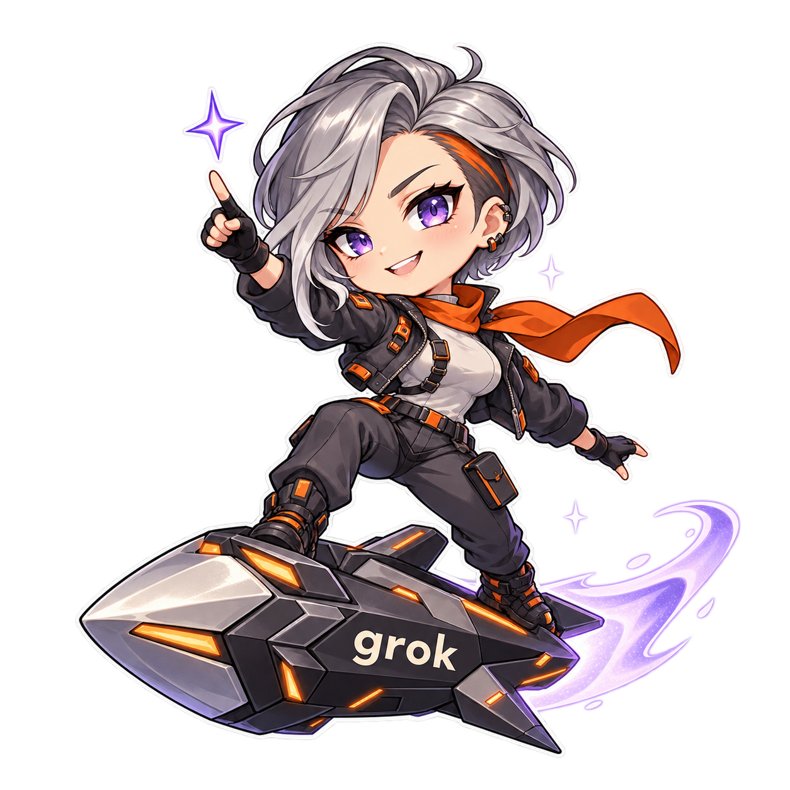
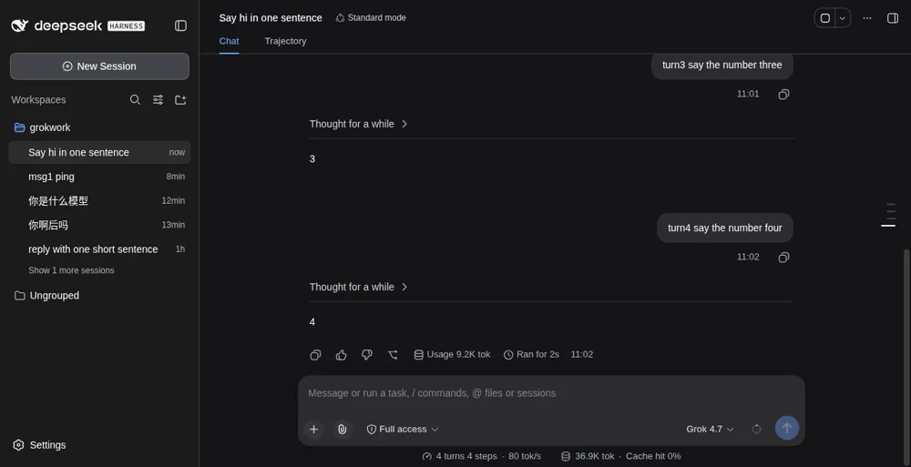
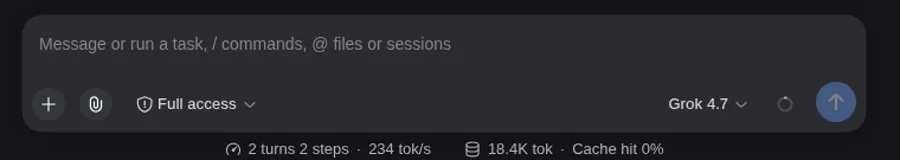
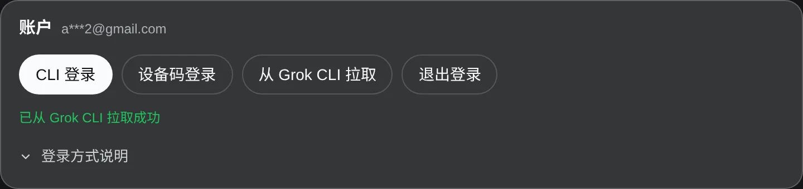
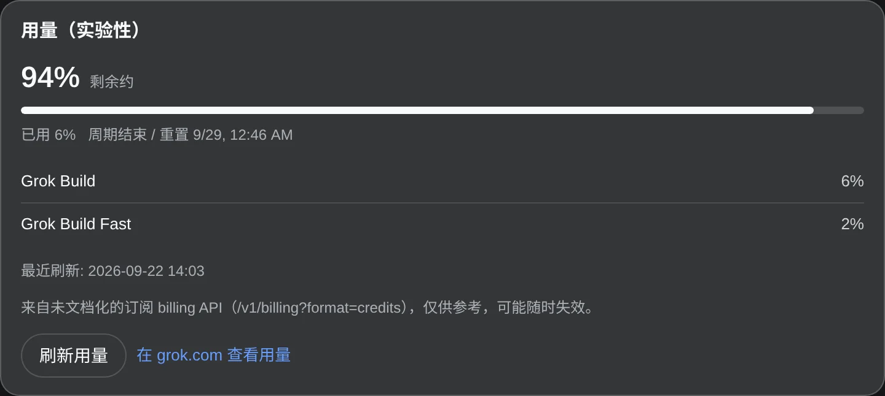

<div align="center">



# DSH Grok Subscription

[简体中文](README.md) · **English**

**Code, ask about images, and adjust reasoning in DSH with your Grok Build subscription.**

Reuse the official Grok Build CLI session to select models, attach images, and check weekly quota inside DeepSeek Harness.
No separate pay-as-you-go xAI API key is required.

[](https://github.com/BaronCyrus/dsh-grok-subscription/actions/workflows/ci.yml)
[](https://www.npmjs.com/package/dsh-grok-subscription)
[](https://www.npmjs.com/package/dsh-grok-subscription)
[](LICENSE)
[](https://github.com/BaronCyrus/dsh-grok-subscription/stargazers)

[Features](#features) · [Install](#install) · [Daily use](#daily-use) · [Screenshots](#screenshots) · [User guide](#user-guide) · [Update and uninstall](#update-and-uninstall)

</div>

<a id="why-this-plugin"></a>

## Features

| Capability | What it does |
| --- | --- |
| **Reuse subscription sign-in** | Start CLI / device-code login in Settings, or pull an existing Grok CLI session without manually pasting tokens |
| **Model catalog sync** | Prefers the account's live catalog after sign-in, with a built-in fallback when that read fails; no models appear while signed out |
| **Reasoning effort** | Select the levels offered by each model, typically `low` / `medium` / `high` / `xhigh`, with `high` preferred by default |
| **Image input** | Paste or attach images for supported models; Settings shows the active adapter path and attachment capability |
| **Weekly quota** | The composer badge and Settings show reported usage; the experimental quota reader never invents missing numbers |
| **Session renewal and updates** | Attempts renewal through the official CLI near token expiry or after an authentication rejection; Settings also checks plugin versions |
| **No tokens in browser responses** | Access tokens are used Host-side; a subscription failure never silently selects another paid model route |

<a id="three-step-start"></a>
<a id="prepare-dsh"></a>

## Install

You need **DeepSeek Harness**, the **official Grok Build CLI on the same machine**, and a SuperGrok / X Premium account that **currently has Grok Build access**. The subscription name alone does not guarantee that access; the account's actual authorization determines it.

For DSH setup, see the [official instructions](https://github.com/deepseek-ai/deepseek-harness#run). Version requirements and CLI paths are covered in [Installation and compatibility](docs/guide.en.md#installation-and-compatibility).

### 1. Install the plugin

```sh
dsh plugin --profile web add dsh-grok-subscription@latest
```

Then **manually restart the target DSH instance**. Refreshing the browser alone does not reload the Host adapter.

### 2. Sign in

Open **Settings → Grok Subscription** and select **CLI login** or **Device-code login**. Follow the browser and panel instructions. If you already ran `grok login`, select **Pull from Grok CLI**.

> This plugin relies on the official Grok Build CLI for sign-in and renewal; it is not CLI-independent. Do not paste `XAI_API_KEY`, and never share `auth.json` or tokens in chats, screenshots, or public issues.

### 3. Select a model

Pick a Grok model your account can use, adjust reasoning effort as needed, and start chatting or coding. The badge beside the model shows weekly quota when usage can be read successfully.

<details>
<summary>Verify the install / use npx / pin a version</summary>

```sh
dsh plugin --profile web list dsh-grok-subscription --depth 0
```

Without a global `dsh` command, retain your full `npx` launcher prefix. This example uses the baseline version declared in the package metadata:

```sh
npx -y @deepseek-ai/dsh@0.1.5-rc.2 plugin --profile web add dsh-grok-subscription@latest
```

See the [full user guide](docs/guide.en.md) for pinned npm versions, GitHub-source installs, CLI paths, and Headless usage.

</details>

## Daily use

**Choose a model and effort.** The catalog refreshes after sign-in. Use the effort levels shown for the selected model. A built-in fallback catalog does not grant additional model access.

**Ask about images.** Paste or attach an image while using a supported model. The current implementation advertises image input for `grok-4.7`, `grok-4.7-build-fast`, and `grok-4.6`, but not `grok-4.5`. This means **reading images, not generating them**. See [Image input](docs/guide.en.md#image-input).

**Check weekly quota.** With the `grok-build` route selected, the badge shows the remaining percentage when the read succeeds; hover or click for the reset time. Settings has the full details. A failed quota read does not itself block chat.

<a id="product-screen"></a>

## Screenshots

<p align="center">
  
</p>

<p align="center">
  
</p>

<details>
<summary>Show the sign-in and experimental usage panels</summary>

<p align="center">
  
</p>

<p align="center">
  
</p>

Identity and time values in the account screenshot are demo data. Usage screenshots illustrate the UI, not a fixed allowance for any account.

</details>

## User guide

The [full user guide](docs/guide.en.md) covers CLI sign-in, the model catalog, images, quota limitations, network troubleshooting, Headless usage, and development.

Quick links: [Sign-in and credentials](docs/guide.en.md#sign-in-and-credentials) · [Image input](docs/guide.en.md#image-input) · [Troubleshooting](docs/guide.en.md#troubleshooting) · [Contributing](CONTRIBUTING.md).

## Update and uninstall

**Update an npm installation:** check versions in Settings. Supported npm installs can update there, or you can run:

```sh
dsh plugin --profile web add dsh-grok-subscription@latest
```

For a GitHub-source install, use `dsh plugin --profile web update dsh-grok-subscription`. For a local `link:` install, pull and rebuild the checkout instead of replacing its development link.

The desktop app owns its `desktop` profile exclusively, so `dsh plugin --profile desktop …` is refused there. The desktop **Update plugin** button therefore installs the exact version inside that profile directory with DSH's own bundled pnpm; before `1.1.1` that button always failed in the desktop app. Manual steps: [Updates and sign-out](docs/guide.en.md#updates-and-sign-out).

**Uninstall:**

```sh
dsh plugin --profile web remove dsh-grok-subscription
```

Restart DSH afterwards. Removal does not delete other plugins, the whole profile, or the CLI's `auth.json`; it is not the same as signing out of the official CLI. See [Updates and sign-out](docs/guide.en.md#updates-and-sign-out).

<a id="troubleshooting"></a>

## FAQ

**Empty model list?** Confirm that the official CLI has a subscription session, then select **Pull from Grok CLI** in Settings. An API-key-only CLI configuration is not a subscription login.

**Sign-in or requests time out?** Check connectivity from the DSH host to account and subscription services, including its launch-time proxy settings. Network issues, authentication, or service errors can cause failures; do not assume the quota is exhausted. See [Troubleshooting](docs/guide.en.md#troubleshooting).

**Images still unavailable after updating?** Fully restart DSH, check the model's image support, and check the attachment capability shown under **Active path** in Settings.

## Scope and support

This is a community plugin, not affiliated with or endorsed by DeepSeek or xAI. Model access, reasoning options, and quota depend on the account and backend; the plugin does not grant extra entitlements.

The usage panel depends on an undocumented billing endpoint and is **experimental**. Upstream changes may make it unavailable. Keeping credentials out of browser responses does not mean offline inference: model requests still go to the Grok subscription service.

See [SECURITY.md](SECURITY.md) and use [Issues](https://github.com/BaronCyrus/dsh-grok-subscription/issues) for reports. Never publish login files, tokens, raw account responses, or complete login callbacks.

## Local development

```sh
git clone https://github.com/BaronCyrus/dsh-grok-subscription.git
cd dsh-grok-subscription
npm ci
npm test
npm run build
```

`lib/` contains committed build output. Rebuild it after changing `src/` rather than editing it by hand. See [CONTRIBUTING.md](CONTRIBUTING.md) for development and verification requirements.

## License

[MIT](LICENSE)
